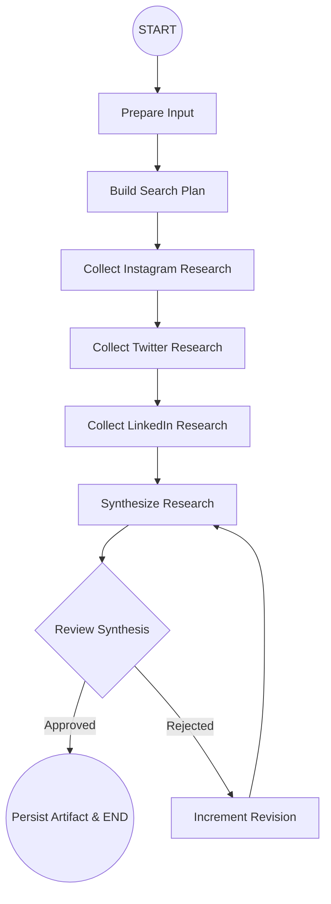
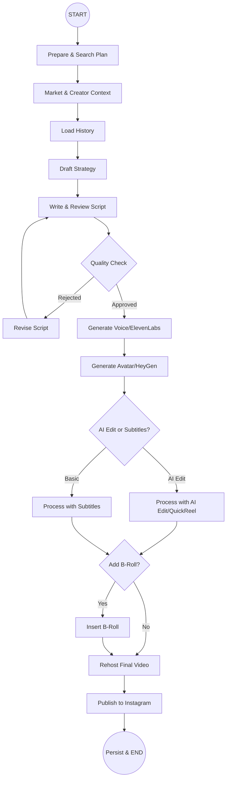
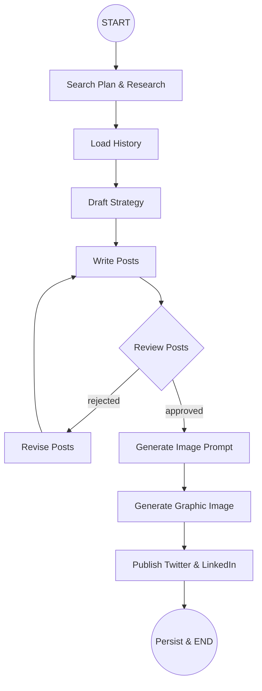

# Content Automation OS ⚡

Welcome to the **Content Automation OS**, a production-grade, highly scalable AI platform powered by **LangGraph**, **Streamlit**, and agentic AI architectures. The system is designed to fully automate cross-platform social media research, intelligent content generation, reel creation with avatars, and automated publishing.

---

## 🎯 Features

- **Multi-Agent Research Pipeline:** Automatically scrapes and synthesizes trending hashtags, competitor strategies, and viral metrics from Instagram, LinkedIn, and Twitter (X).
- **Automated Script & Post Writing:** Analyzes historical brand content and writes high-engagement scripts and social media posts.
- **AI-Powered Review & Reflection:** Self-correcting LangGraph pipelines critique initial AI drafts based on viral metrics and rewrite them to perfection.
- **Full Video & Avatar Generation:** Synthesizes voiceovers with ElevenLabs, generates AI avatars with HeyGen, and edits dynamic subtitles/B-Roll using QuickReel.
- **Direct Platform Publishing:** Seamless integration securely pushes the final content right to Instagram, LinkedIn, and Twitter natively.
- **Streamlit Command Center:** A beautiful Glassmorphism UI provides the user with deep insights, reel analysis, tweet summaries, and configuration toggles.
- **Scalable Architecture:** Structured modular Python design to handle asynchronous calls, retry mechanisms, and concurrent workflows.

---

## 🏗️ Architecture: LangGraph Agentic Pipelines

This platform uses three deeply-integrated [LangGraph](https://python.langchain.com/docs/langgraph) workflows. Each pipeline uses `MemorySaver()` checkpoints for fault tolerance.

### 1. Content Research Automation (`content_research`)
This pipeline generates a cross-platform strategic brief. It analyzes recent Instagram reels, scrapes top Twitter threads, retrieves active LinkedIn posts, and synthesizes a high-level creative direction.



### 2. Instagram Reel Content Automation (`instagram_reels`)
This complex pipeline orchestrates a multi-step creative process to script, produce, and publish Instagram Reels. It handles complex conditional branches, determining if the video requires AI editing, subtitles, or B-roll insertion based on the input requests.



### 3. LinkedIn & Twitter Content Automation (`social_autopost`)
This intelligent pipeline builds professional-grade posts. It checks brand history to avoid repetition, drafts posts, generates image prompts, synthesizes relevant assets using the text, and schedules the final multi-platform campaign.



---

## 🛠️ Installation Guide

### Prerequisites
- Python 3.10+
- Environment variables and API keys for the integrations (Apify, ElevenLabs, HeyGen, Optional: Twitter/IG credentials)

### 1. Clone & Setup
```bash
git clone https://github.com/your-username/ContentAutomation.git
cd ContentAutomation/ResearchTool

# Create a virtual environment
python -m venv venv

# Activate the venv
# On Windows:
venv\Scripts\activate
# On macOS/Linux:
source venv/bin/activate

# Install dependencies
pip install -r requirements.txt
```

### 2. Environment Configuration
Copy `.env.example` to `.env` and fill in your enabled configurations.
```bash
cp .env.example .env
```
Key Providers:
- **OpenRouter/LLM**: Required for all LangChain/LangGraph agent operations and image prompting. 
- **Apify**: Required for social platform scraping stages.
- **Media Providers**: ElevenLabs, HeyGen, and QuickReel parameters are required to run the `instagram_reels` pipeline.
- **Publishing Auth**: Instagram Graph API, Twitter Developer API, and LinkedIn Access Tokens are required if you configure the pipeline to auto-publish.

### 3. Running the UI Command Center
The frontend dashboard provides visualization of recent scraper data and a config builder to trigger background requests to the agents.
```bash
streamlit run app.py
```

### 4. Running Workflows Locally (CLI)

You can manually trigger specific pipelines using terminal execution. Ensure you pass a valid input `.json` containing your configuration.

```bash
# Run the Master Research Pipeline
python -m content_research_automation.main --input input.json

# Run the LinkedIn/Twitter Auto-Poster
python -m linkedin_twitter_contentautomation.main --input input.json

# Run the Full Instagram Reel Pipeline
python -m insta_reel_contentautomation.main --input input.json
```

---

## 🔒 Security Notes
The project is built emphasizing secure credential management. The UI requires access via standard Auth mapped within a secure dictionary (defaulted locally via `security.json`). Never commit your `.env`, access tokens, or `security.json` files to Git.
