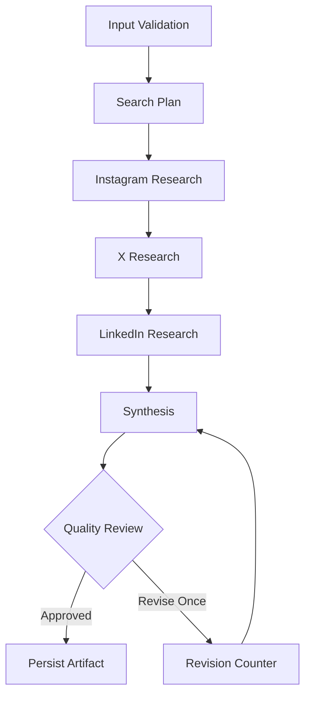
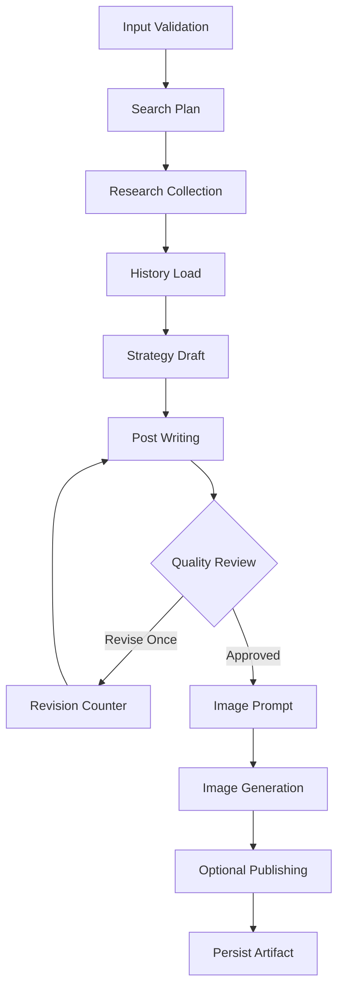
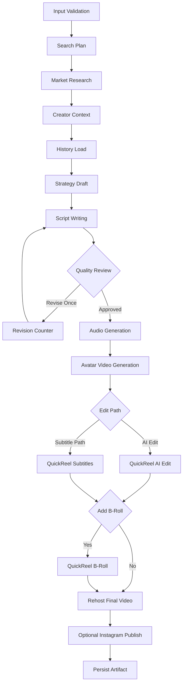

# Content Automation OS

Content Automation OS is a production-oriented LangGraph project for research, social copy generation, and Instagram reel production. It provides three agentic pipelines, a shared integration layer, CLI entry points, structured artifacts, and a Streamlit dashboard for inspection and manual triggering.

The repository is designed for teams that want to run the pipelines locally, schedule them in an external job runner, or embed them inside a larger content operations platform.

## What the project includes

- Three LangGraph pipelines for research, social copy generation, and Instagram reel production.
- A shared `common/` runtime for configuration, retries, HTTP clients, and data utilities.
- A Streamlit dashboard for browsing results and launching a backend trigger.
- Example input payloads for each pipeline.
- Publish-safe configuration templates with no bundled secrets.

## Repository structure

```text
ResearchTool/
|- app.py
|- README.md
|- requirements.txt
|- .env.example
|- .gitignore
|- dashboard_config.example.json
|- common/
|  |- clients.py
|  |- llm.py
|  |- logging.py
|  |- settings.py
|  `- utils.py
|- content_research_automation/
|  |- graph.py
|  |- main.py
|  |- prompts.py
|  `- schemas.py
|- linkedin_twitter_automation/
|  |- graph.py
|  |- main.py
|  |- prompts.py
|  `- schemas.py
|- instagram_reel_automation/
|  |- graph.py
|  |- main.py
|  |- prompts.py
|  `- schemas.py
`- examples/
   `- inputs/
      |- content_research.json
      |- linkedin_twitter.json
      `- instagram_reel.json
```

## Core capabilities

### Shared runtime

The `common/` package contains the reusable infrastructure used by all three pipelines.

- `common/settings.py`: environment-driven settings using `pydantic-settings`.
- `common/clients.py`: API clients for OpenRouter, Apify, Google Sheets, ElevenLabs, HeyGen, QuickReel, LinkedIn, X, and Instagram Graph.
- `common/utils.py`: ranking, summarization, polling, JSON cleanup, and artifact persistence helpers.
- `common/logging.py`: project-wide logging bootstrap.

### Pipeline design principles

All three pipelines follow the same design rules.

- Typed input and output schemas with Pydantic.
- Explicit LangGraph state objects per workflow.
- Structured outputs from LLM calls instead of free-form parsing where possible.
- Retry-aware external clients for network operations.
- Artifact persistence for traceability.
- Dry-run support on publishing paths.
- Optional Google Sheets persistence when credentials are configured.

## Pipeline architecture

### 1. Content research automation

Purpose:
Create a research brief that combines Instagram signals, X trends, and LinkedIn activity into a usable content strategy package.

Key responsibilities:

- Generate or normalize search terms.
- Scrape and rank Instagram reels.
- Extract transcripts from high-performing reels.
- Summarize X and LinkedIn activity.
- Produce a structured research synthesis.
- Run one review pass before persistence.


```mermaid
graph TD
    A[Input Validation] --> B[Search Plan]
    B --> C[Instagram Research]
    C --> D[X Research]
    D --> E[LinkedIn Research]
    E --> F[Synthesis]
    F --> G{Quality Review}
    G -->|Approved| H[Persist Artifact]
    G -->|Revise Once| I[Revision Counter]
    I --> F
```

Primary inputs:

- niche definition
- creator positioning
- language and writing preferences
- reel scraping limits
- optional competitors

Primary outputs:

- structured research brief
- recommended topics
- cross-platform findings
- JSON artifact in `artifacts/content_research/`

### 2. LinkedIn and X automation

Purpose:
Turn market research and posting history into platform-specific social copy and a supporting LinkedIn visual concept.

Key responsibilities:

- Build search queries for current conversations.
- Collect X and LinkedIn examples.
- Load optional posting history from Google Sheets.
- Generate strategy.
- Generate LinkedIn and X posts.
- Review the draft and revise once when needed.
- Create a LinkedIn image prompt and optional generated image.
- Publish to X and LinkedIn when enabled.


```mermaid
graph TD
    A[Input Validation] --> B[Search Plan]
    B --> C[Research Collection]
    C --> D[History Load]
    D --> E[Strategy Draft]
    E --> F[Post Writing]
    F --> G{Quality Review}
    G -->|Revise Once| H[Revision Counter]
    H --> F
    G -->|Approved| I[Image Prompt]
    I --> J[Image Generation]
    J --> K[Optional Publishing]
    K --> L[Persist Artifact]
```

Primary inputs:

- niche definition
- writing style
- dry-run versus publish mode
- optional custom search phrases

Primary outputs:

- LinkedIn post package
- X post package
- LinkedIn image prompt
- generated image preview URL when configured
- JSON artifact in `artifacts/social_autopost/`

### 3. Instagram reel automation

Purpose:
Research a niche, write a reel script, generate voice and avatar video, optionally add subtitles and B-roll, and optionally publish the final reel.

Key responsibilities:

- Research the target niche and creator context.
- Build a reel strategy from market data and content history.
- Write a reel script package with hook, body, CTA, caption, and B-roll guidance.
- Review and revise the package once if needed.
- Generate narration with ElevenLabs.
- Generate the base avatar video with HeyGen.
- Run either subtitle processing or AI edit processing in QuickReel.
- Optionally run a B-roll pass.
- Re-host the final video and optionally publish to Instagram.


```mermaid
graph TD
    A[Input Validation] --> B[Search Plan]
    B --> C[Market Research]
    C --> D[Creator Context]
    D --> E[History Load]
    E --> F[Strategy Draft]
    F --> G[Script Writing]
    G --> H{Quality Review}
    H -->|Revise Once| I[Revision Counter]
    I --> G
    H -->|Approved| J[Audio Generation]
    J --> K[Avatar Video Generation]
    K --> L{Edit Path}
    L -->|AI Edit| M[QuickReel AI Edit]
    L -->|Subtitle Path| N[QuickReel Subtitles]
    M --> O{Add B-Roll}
    N --> O
    O -->|Yes| P[QuickReel B-Roll]
    O -->|No| Q[Rehost Final Video]
    P --> Q
    Q --> R[Optional Instagram Publish]
    R --> S[Persist Artifact]
```

Primary inputs:

- niche definition
- optional Instagram profile URL for creator-context scraping
- subtitle and B-roll preferences
- avatar and voice identifiers
- dry-run versus publish mode

Primary outputs:

- script package
- base and final video URLs
- publish result when enabled
- JSON artifact in `artifacts/instagram_reels/`

## Integrations

The project uses external providers for research, generation, and publishing. Each integration is optional unless required by the specific pipeline path you are running.

| Integration | Purpose | Required for |
| --- | --- | --- |
| OpenRouter | LLM reasoning, structured generation, image prompting | all pipelines |
| Apify | social research and transcript extraction | all pipelines |
| Google Sheets | optional history reads and result persistence | all pipelines when sheet mode is enabled |
| ElevenLabs | narration generation | Instagram reel automation |
| HeyGen | avatar video generation | Instagram reel automation |
| QuickReel | subtitles, edits, B-roll | Instagram reel automation |
| X API | publishing to X | LinkedIn and X automation when publishing is enabled |
| LinkedIn API | publishing to LinkedIn | LinkedIn and X automation when publishing is enabled |
| Instagram Graph API | publishing reels | Instagram reel automation when publishing is enabled |
| Temporary file hosting | intermediate media hosting | pipelines that need generated binary assets |

## Installation

### Prerequisites

- Python 3.10 to 3.12 is recommended. Python 3.14 currently triggers third-party LangChain compatibility warnings in this environment.
- Access to the external providers you intend to use
- A virtual environment manager such as `venv`, `uv`, or `conda`

### 1. Clone the repository

```bash
git clone https://github.com/your-org/ContentAutomation.git
cd ContentAutomation/ResearchTool
```

### 2. Create and activate a virtual environment

```bash
python -m venv .venv
```

Windows PowerShell:

```bash
.\.venv\Scripts\Activate.ps1
```

macOS or Linux:

```bash
source .venv/bin/activate
```

### 3. Install dependencies

```bash
pip install -r requirements.txt
```

## Configuration

### Environment file

Copy `.env.example` to `.env` and populate only the providers you need.

Windows:

```bash
copy .env.example .env
```

macOS or Linux:

```bash
cp .env.example .env
```

### Environment variables

#### Required for all pipelines

- `OPENROUTER_API_KEY`
- `APIFY_API_TOKEN`

#### Optional runtime settings

- `OPENROUTER_TEXT_MODEL`
- `OPENROUTER_REASONING_MODEL`
- `OPENROUTER_IMAGE_MODEL`
- `ARTIFACT_ROOT`
- `GOOGLE_SERVICE_ACCOUNT_JSON`
- `GOOGLE_SHEET_ID`

#### Dashboard settings

- `RESEARCH_SHEET_ID`: Google Sheet used by the Streamlit dashboard.
- `AGENT_API_URL`: optional backend endpoint used by the dashboard trigger form.
- `DASHBOARD_AUTH_ENABLED`: set to `true` to enable dashboard login.
- `DASHBOARD_USERS_JSON`: JSON object of username/password pairs for local dashboard auth.

#### Media and publishing settings

- `ELEVENLABS_API_KEY`
- `HEYGEN_API_KEY`
- `QUICKREEL_API_KEY`
- `FACEBOOK_ACCESS_TOKEN`
- `INSTAGRAM_BUSINESS_ACCOUNT_ID`
- `TWITTER_CONSUMER_KEY`
- `TWITTER_CONSUMER_SECRET`
- `TWITTER_ACCESS_TOKEN`
- `TWITTER_ACCESS_TOKEN_SECRET`
- `LINKEDIN_ACCESS_TOKEN`
- `LINKEDIN_AUTHOR_URN`

### Optional dashboard config file

You can also create a local `dashboard_config.json` based on `dashboard_config.example.json`.

Use it when you want a file-based local dashboard configuration instead of environment variables. Do not commit it.

## Usage

### Command-line execution

The repository includes one CLI entry point per pipeline.

#### Content research automation

```bash
python -m content_research_automation.main --input examples/inputs/content_research.json
```

#### LinkedIn and X automation

```bash
python -m linkedin_twitter_automation.main --input examples/inputs/linkedin_twitter.json
```

#### Instagram reel automation

```bash
python -m instagram_reel_automation.main --input examples/inputs/instagram_reel.json
```

### Input payloads

Example payloads are provided in `examples/inputs/`.

Important notes:

- Set `dry_run` to `false` only after all publishing credentials are configured.
- Provide `avatar_id` and `voice_id` for the Instagram reel pipeline. They are intentionally blank by default in the public repository.
- Use `persist_to_sheet` only when Google Sheets credentials and sheet identifiers are configured.

### Streamlit dashboard

Run the dashboard locally with:

```bash
streamlit run app.py
```

The dashboard can:

- load research output from a configured Google Sheet
- display reels, scripts, X posts, and competitor summaries
- send trigger payloads to an optional external backend endpoint

If `DASHBOARD_AUTH_ENABLED` is `false`, the dashboard opens without a login screen.

## Scheduling and deployment

The pipelines are CLI-first and do not require a built-in scheduler. That makes them easy to run from the orchestration system your team already uses.

### Common scheduling patterns

- Windows Task Scheduler for workstation or VM-based execution.
- cron on Linux servers.
- GitHub Actions on a timer for repository-based automation.
- Airflow, Prefect, Dagster, or Temporal in larger data and media stacks.
- Container jobs in Kubernetes, ECS, or Cloud Run jobs.

### Windows Task Scheduler example

Program:

```text
python
```

Arguments:

```text
-m content_research_automation.main --input C:\path\to\content_research.json
```

Start in:

```text
C:\path\to\ContentAutomation\ResearchTool
```

### cron example

```bash
0 9 * * * cd /srv/ContentAutomation/ResearchTool && /srv/ContentAutomation/.venv/bin/python -m linkedin_twitter_automation.main --input examples/inputs/linkedin_twitter.json
```

## Artifacts and outputs

Each pipeline writes a JSON artifact to an `artifacts/` subdirectory when it completes successfully.

Typical uses for these artifacts:

- traceability for operator review
- downstream ingestion into dashboards or content systems
- replay and debugging
- comparing revisions across runs

## Security guidance

This repository is structured for public sharing and should remain free of secrets.

- Keep `.env` out of version control.
- Keep `dashboard_config.json` out of version control.
- Store provider credentials in your secrets manager, CI secret store, or deployment platform.
- Treat generated artifacts as potentially sensitive if they contain unpublished content, internal strategy, or private URLs.
- Use dry-run mode until publishing credentials and account scopes are verified.

## Validation

The repository should be validated locally before production use.

Recommended checks:

```bash
python -m compileall app.py common content_research_automation linkedin_twitter_automation instagram_reel_automation
python -c "import content_research_automation.main, linkedin_twitter_automation.main, instagram_reel_automation.main"
```

You should also run end-to-end smoke tests with your own credentials for any provider-backed path you intend to use in production.

## Production readiness notes

What is already implemented in code:

- typed schemas for workflow inputs and structured outputs
- LangGraph state machines with checkpointing
- retry-aware external API clients
- dry-run support on publish paths
- reusable artifact persistence

What still depends on your environment:

- provider credentials
- sheet identifiers and service account access
- publish permissions on social platforms
- scheduler or job runner selection
- infrastructure for webhook or backend trigger endpoints if you want dashboard-triggered execution

## License

Add the license appropriate for your organization before publishing the repository.
